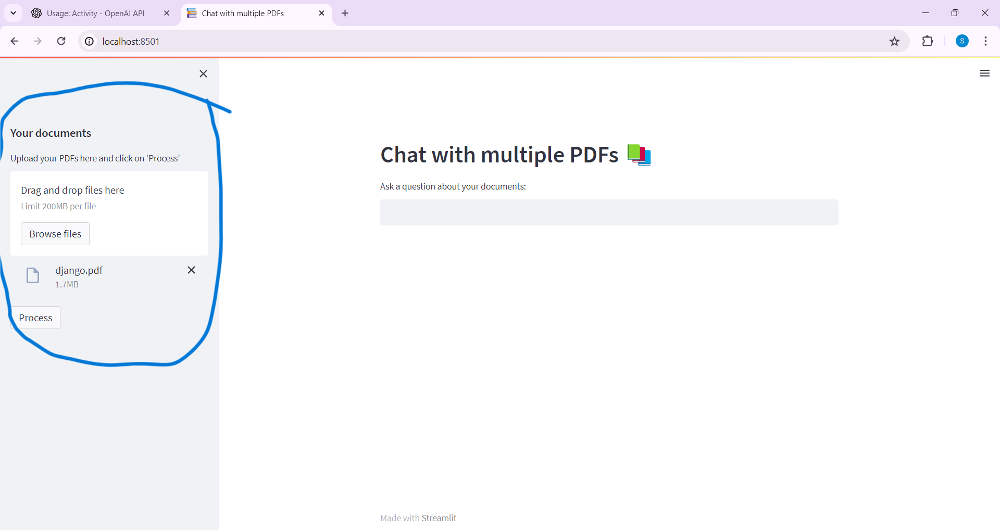
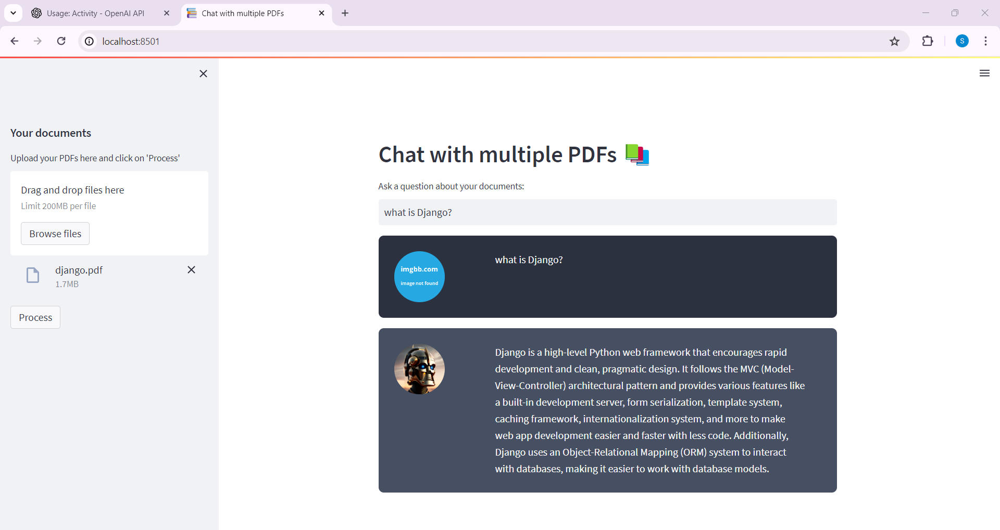
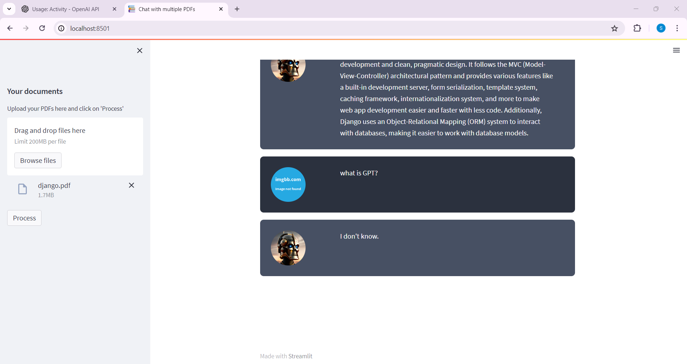

## Introduction
---------------
The MultiPDF Chat App is a Python application designed for interacting with multiple PDF documents through natural language queries. Users can ask questions about the contents of the PDFs, and the app will generate relevant responses based on the documents' information. Leveraging a powerful language model, the app provides accurate answers to queries specifically related to the loaded PDFs.

## Steps TO Follow:
-------------------
To use the MultiPDF Chat App, follow these steps:

1. Ensure that you have installed the required dependencies and added the OpenAI API key to the `.env` file.

2. Run the `main.py` file using the Streamlit CLI. Execute the following command:
   ```
   streamlit run app.py
   ```

3. The application will launch in your default web browser, displaying the user interface.

4. Load multiple PDF documents into the app by following the provided instructions.

5. Ask questions in natural language about the loaded PDFs using the chat interface.


.png>)







